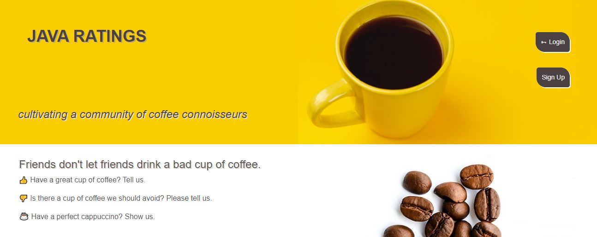

# Java Ratings

## Description

Java Ratings is empowering Coffee Connoisseurs around the world to impart their wisdom on others within the community.

## Built With

- Express.js
- MySQL2
- Sequelize
- Node.js
- handlebars.js
- Multer
- GET and POST routes
- Bootstrap
- JavaScript
- bcrypt
- dotenv

## Repository

[GitHub] https://github.com/TylerEvans-hash/java-ratings.git
[Screenshot] 

[Heroku]

## Contributors

- Modules 13 and 14 from Bootcamp
- Cade Ellsworth @EEzycade
- Tyler Evans @TylerEvans-hash
- Tim Gelety @Tim-Gelety
- Natasha Harrison @natasharrison

## Future Development / Bugs
